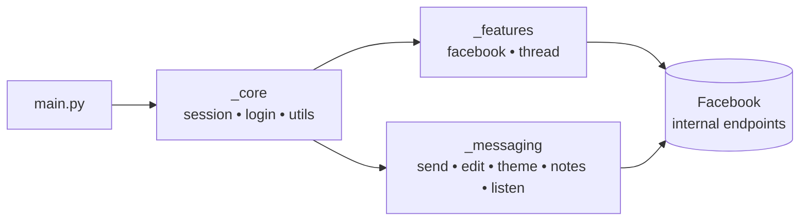

<div align="center">

# FBChat-Remake — Open Source

### Facebook Messenger API ke liye ek modern Python library (unofficial), jo real user account ke zariye kaam karta hai

[](https://github.com/PrinceMalhotra/fbchat-v2)
[](https://pypi.org/project/fbchat-v2/)
[](https://www.python.org/)
[](https://github.com/PrinceMalhotra/fbchat-v2/releases)
[](https://github.com/PrinceMalhotra/fbchat-v2/issues)
[](LICENSE)

[**📖 Docs**](DOCS.md) · [**📦 PyPI**](https://pypi.org/project/fbchat-v2/) · [**📊 Flowchart**](FLOWCHART.md) · [**🐛 Bug Report**](https://github.com/PrinceMalhotra/fbchat-v2/issues)

</div>

---

## 📢 Zaroori Soochna

> **November 2024 se**, Facebook ne Messenger par sabhi user-to-user conversations ke liye **End-to-End Encryption (E2EE)** laagu kar diya hai.
>
> **Update — 12 May 2026:** `fbchat-v2` ab **officially E2EE decrypt support karta hai** direct Messenger messages ke liye, naye module [`_messaging/_listening_e2ee.py`](src/_messaging/_listening_e2ee.py) aur Go binary [`bridge-e2ee/`](bridge-e2ee/) ke zariye. Event payload schema **bilkul wahi hai** jo purana `_listening.py` deta tha — sirf import badlo aur kaam ho jaega.
>
> Group messages abhi bhi `_listening.py` (MQTT WebSocket) use karte hain; 1-1 messages `_listening_e2ee.py` use karte hain.

> ⚠️ **Disclaimer** — Ye project **Facebook ka official product nahi hai**. Facebook ka official chatbot API [yahan milega](https://developers.facebook.com/docs/messenger-platform/). `fbchat-v2` is se alag hai — ye **real Facebook user account / cookies** se authenticate karta hai, jo risk lata hai. Samajhdaari se use karo.

---

## 👋 Parichay

Namaste, main hoon **Prince Malhotra** — is project ka author aur maintainer.

Sabse pehle, dil se shukriya un sabhi users aur contributors ka jo ideas share kiye aur bugs report kiye. Is **bade v2.x update** mein codebase ko **poori tarah restructure** kiya gaya hai, jyadatar purane bugs fix ho gaye hain aur E2EE aur `async`/`await` jaisi aane wali features ka base taiyar ho gaya hai.

Kuch choti-moti dikkatein abhi bhi ho sakti hain. Agar koi **problem mile**, toh [GitHub](https://github.com/PrinceMalhotra/fbchat-v2/issues) par issue kholo ya seedha message karo.

---

## 📑 Table of Contents

- [Features](#-features)
- [Architecture](#-architecture)
- [Project Structure](#-project-structure)
- [System Requirements](#-system-requirements)
- [Installation](#-installation)
- [Quick Start](#-quick-start)
- [Configuration](#-configuration)
- [Module Docs](#-module-docs)
- [Roadmap](#-roadmap)
- [Contributing](#-contributing)
- [Contributors](#-contributors)
- [License](#-license)

---

## ✨ Features

`fbchat-v2` official SDK se alag approach follow karta hai: kisi fanpage ke `access_token` ki jagah, ye ek **real Facebook account** ko cookies ya credentials ke zariye control karta hai aur poora Messenger unlock kar deta hai.

### Authentication
- 🔐 **Username / password** ya **session cookies** se login (*)
- 🍪 Session reuse — har baar login karne ki zaroorat nahi

### Messaging
- 📥 **Users** aur **group chats** dono se messages padho
- 🔐 **E2EE listener** for 1-1 DMs (Secret Conversations / Labyrinth) Go bridge ke zariye
- 📤 Text, **attachments**, **stickers**, aur **mentions** bhejo
- 🔍 Messages aur conversations search karo
- ✏️ Bheje hue messages edit karo, react karo, unsend karo, message requests handle karo
- 🎨 Messenger thread themes / backgrounds badlo aur **Messenger Notes** manage karo
- 📡 Real-time **listener** — tatkaal command-based replies

### Threads & Groups
- 👥 Groups banao, admins add karo, thread name / emoji / nicknames badlo
- 📊 Polls banao aur thread metadata dekho

### Facebook Features (`_features._facebook`)
- 📝 Posts daalo, bio badlo, profile register karo
- 👤 Users search karo, profile info lo, notifications manage karo
- 🚫 Block / unblock, Marketplace aur Professional mode manage karo

### Jaldi Aa Raha Hai
- ⚡ Native `async` / `await` support
- 📦 Windows / Linux / macOS ke liye pre-built E2EE bridge binaries

> (*) Cookie / credential-based login mein security risk hota hai; apna token kabhi share mat karo.

---

## 🏗 Architecture

Codebase ko **3 clearly defined layers** mein split kiya gaya hai:

| Layer | Path | Kaam |
|---|---|---|
| **Core** | `src/_core/` | Session, login, request helpers, low-level utilities |
| **Features** | `src/_features/` | Facebook & thread business logic (posts, groups, profile, …) |
| **Messaging** | `src/_messaging/` | Send / edit / receive / react / theme / notes / unsend — sab chat-related |



📊 Poora flowchart [FLOWCHART.md](FLOWCHART.md) mein dekho.

---

## 📂 Project Structure

```text
fbchat-v2/
├── src/
│   ├── main.py                          # Demo bot — entry point
│   ├── config.json                      # Cookies + runtime config
│   ├── _core/                           # ── Foundation layer ──
│   │   ├── _facebookLogin.py
│   │   ├── _session.py
│   │   └── _utils.py
│   ├── _features/                       # ── Feature layer ──
│   │   ├── _facebook/
│   │   │   ├── _blocking.py
│   │   │   ├── _changeBio.py
│   │   │   ├── _createPost.py
│   │   │   ├── _get_user_info.py
│   │   │   ├── _marketplace.py
│   │   │   ├── _notification.py
│   │   │   ├── _professional.py
│   │   │   ├── _registerOnProfile.py
│   │   │   └── _search.py
│   │   └── _thread/
│   │       ├── _addAdmin.py
│   │       ├── _all_thread_data.py
│   │       ├── _changeEmoji.py
│   │       ├── _changeNameThread.py
│   │       └── _changeNickname.py
│   └── _messaging/                      # ── Messaging layer ──
│       ├── _attachments.py
│       ├── _changeTheme.py              # Messenger thread theme / background badlo
│       ├── _createNotes.py              # Messenger Notes (24h status)
│       ├── _editMessage.py              # Bheje hue messages edit karo MQTT LS task se
│       ├── _listening.py                # MQTT — group messages
│       ├── _listening_e2ee.py           # Go bridge — 1-1 E2EE messages
│       ├── _message_requests.py
│       ├── _reactions.py
│       ├── _send.py
│       ├── _send_e2ee.py                # Go bridge — 1-1 E2EE messages bhejo
│       └── _unsend.py
├── bridge-e2ee/                         # ── E2EE ke liye Go bridge ──
│   ├── main.go
│   ├── go.mod
│   └── README.md
├── build/                               # `go build` se bana binary `fbchat-bridge-e2ee`
├── language/
│   └── vi_VN.lang
├── docs/
├── DOCS.md
├── FLOWCHART.md
├── CODE_OF_CONDUCT.md
├── LICENSE
└── requirements.txt
```

---

## 🔧 System Requirements

| Component | Minimum | Recommended | Notes |
|---|---|---|---|
| Python | 3.10 | 3.11 / 3.12 | Zaroori |
| Go (toolchain) | 1.24 | 1.24+ | **Sirf E2EE ke liye** — `fbchat-bridge-e2ee` build karne ke liye |
| Git | koi bhi | latest | `go mod tidy` ke liye mautrix/meta fetch karne ke liye |
| OS | Windows / Linux / macOS | — | — |
| RAM | 256 MB | 1 GB+ | E2EE bridge runtime mein ~80–150 MB leta hai |
| Network | Stable connection, `facebook.com` aur `edge-chat.facebook.com` accessible ho | — | — |

Python dependencies [requirements.txt](requirements.txt) mein hain:

```text
requests>=2.31.0   # HTTP client
paho-mqtt>=1.6.1   # MQTT WebSocket for _listening.py
attrs>=23.2.0      # Decorator class
pyotp>=2.9.0       # 2FA TOTP when logging in with username/password
```

---

## 📦 Installation

> Ek line mein: **Steps 1–4 sab ke liye zaroori hain**. **Step 5 sirf tab chahiye jab 1-1 (E2EE) messages receive karne hon**.

### 1. Repository clone karo

```bash
git clone https://github.com/PrinceMalhotra/fbchat-v2
cd fbchat-v2
```

> Alternative: GitHub par `Code → Download ZIP`.

### 2. Virtual environment banao *(optional but recommended)*

```bash
python -m venv .venv
```

Activate karo:

```bash
# Windows (PowerShell)
.venv\Scripts\activate

# macOS / Linux
source .venv/bin/activate
```

### 3. Python dependencies install karo

```bash
pip install --upgrade pip
pip install -r requirements.txt
```

Quick check:

```bash
python -c "import requests, paho.mqtt.client, attr, pyotp; print('OK')"
```

### 4. `src/` ko importable banao

Project root se script chalate waqt, `src/` expose karo taaki `_core`, `_features`, `_messaging` sahi se import hon:

```bash
# Windows (PowerShell)
$env:PYTHONPATH = "src"

# macOS / Linux
export PYTHONPATH=src
```

### 5. *(Optional)* E2EE bridge build karo — 1-1 messages ke liye

Agar sirf group messages chahiye hain, **ye step skip karo**. Warna, direct (E2EE) messages ke liye Go binary `fbchat-bridge-e2ee` chahiye.

#### 5.1. Go toolchain install karo

- Download: <https://go.dev/dl/> (Go ≥ 1.24).
- Fresh terminal mein verify karo:

  ```bash
  go version
  ```

#### 5.2. `mautrix/meta` source fetch karo

```bash
cd bridge-e2ee
git clone https://github.com/mautrix/meta.git ./meta
```

#### 5.3. Deps download karo & build karo

```bash
go mod tidy

# Windows
go build -ldflags="-s -w" -o ../build/fbchat-bridge-e2ee.exe .

# Linux / macOS
go build -ldflags="-s -w" -o ../build/fbchat-bridge-e2ee .
```

#### 5.4. Verify karo

```bash
cd ..
# Windows
.\build\fbchat-bridge-e2ee.exe --help
# Linux/macOS
./build/fbchat-bridge-e2ee --help
```

Binary default location par na ho toh env var set karo:

```bash
# Windows
$env:FBCHAT_E2EE_BIN = "C:\path\to\fbchat-bridge-e2ee.exe"
# Linux/macOS
export FBCHAT_E2EE_BIN=/path/to/fbchat-bridge-e2ee
```

Zyada details: [`bridge-e2ee/README.md`](bridge-e2ee/README.md).

### 6. Cookie configure karo

[`src/config.json`](src/config.json) kholo aur apne Facebook session cookies `cookies` field mein daalo. Details [Configuration](#-configuration) section mein hain.

### 7. Smoke test

```bash
python src/main.py
```

Agar console mein account info aur `last_seq_id` print ho jaye, toh installation complete hai.

---

## 🚀 Quick Start

Ek minimal demo bot [`src/main.py`](src/main.py) mein pehle se hai. Isme kuch basic commands hain setup verify karne ke liye aur apne bot ke liye template ki tarah use karne ke liye.

```bash
python src/main.py
```

Chalane se pehle:

1. `src/config.json` kholo.
2. Apne Facebook session cookies `cookies` field mein daalo.
3. (Optional) File mein jo bhi runtime options hain unhe customize karo.

### E2EE listener enable karo (1-1 chats ke liye)

E2EE ke liye Go binary `fbchat-bridge-e2ee` chahiye. Ek baar build karo:

```bash
cd bridge-e2ee
git clone https://github.com/mautrix/meta.git ./meta
go mod tidy
go build -ldflags="-s -w" -o ../build/fbchat-bridge-e2ee.exe .   # Windows
# Linux/macOS: .exe suffix hata do
```

Phir `_listening.py` ki tarah use karo:

```python
import threading
from _messaging._listening_e2ee import listeningE2EEEvent

listener = listeningE2EEEvent(dataFB)
listener.get_last_seq_id()
threading.Thread(target=listener.connect_mqtt, daemon=True).start()
# listener.bodyResults ka schema _listening.py jaisa hi hai
```

Binary path env var se override karo: `FBCHAT_E2EE_BIN=/path/to/binary`.
Build & RPC docs: [`bridge-e2ee/README.md`](bridge-e2ee/README.md).

#### 📸 Demo — decrypted E2EE direct message receive karna

<div align="center">


<sub><i><code>listeningE2EEEvent</code> ka real output — <code>bodyResults</code> ka schema bilkul <code>_listening.py</code> jaisa hai.</i></sub>

</div>

---

### Messages edit karo, themes badlo, aur Messenger Notes

Extra Messenger actions `_messaging` mein hain aur `_core._session.dataGetHome(...)` wala `dataFB` share karte hain:

```python
from _messaging import _editMessage, _changeTheme, _createNotes

# Bheja hua message edit karo (aksar sirf apne account ke messages edit ho sakte hain)
_editMessage.editMessage(dataFB, "mid.$abc...", "Naya content")

# Themes list karo aur thread theme badlo
themes = _changeTheme.listThemes(dataFB)
_changeTheme.changeTheme(dataFB, "1234567890", "love")

# 24 ghante wala Messenger Note banao
_createNotes.createNote(dataFB, "fbchat-v2 pe kaam ho raha hai", privacy="FRIENDS")
```

Full API details: [`src/_messaging/README.md`](src/_messaging/README.md) aur [DOCS.md](DOCS.md).

---

## ⚙️ Configuration

`src/config.json` sari runtime settings ka single source of truth hai.

| Key | Description |
|---|---|
| `cookies` | Tumhare Facebook session cookies (string form). **Zaroori.** |
| `prefix` | Bot commands ka prefix (e.g. `/`, `!`, `.`) |
| `admins` | Admin Facebook IDs ki list |

> 🔒 **Security:** `config.json` ko secret file ki tarah rakho. Kabhi public repository mein commit mat karo, cookies share mat karo, aur agar leak hone ka shak ho toh turant rotate karo.

---

## 📚 Module Docs

Har layer ka apna README hai. Detailed API examples ke liye wahan se shuru karo:

| Module | Docs |
|---|---|
| `_core` | `src/_core/README_EN.md` |
| `_features` | `src/_features/README_EN.md` |
| `_messaging` | `src/_messaging/README_EN.md` |

Cross-cutting design aur end-to-end request flow ke liye [DOCS.md](DOCS.md) aur [FLOWCHART.md](FLOWCHART.md) padho.

---

## 🗺 Roadmap

- [x] Messenger **E2EE** direct-message decryption *(v2.x — Go bridge)*
- [x] Sent messages edit karo, thread themes badlo, aur Messenger Notes *(v2.1.x)*
- [ ] Native `async` / `await` API
- [ ] Har release ke saath pre-built E2EE bridge binaries
- [ ] Poore public surface par type hints
- [ ] Sessions ke liye pluggable storage backend
- [ ] Zyada integration tests & CI

Ideas hain? [Issues](https://github.com/PrinceMalhotra/fbchat-v2/issues) mein share karo.

---

## 🤝 Contributing

Contributions ka swagat hai.

1. Repository **fork** karo aur feature branch banao:
   ```bash
   git checkout -b feat/<apna-feature>
   ```
2. Existing code style aur layered architecture follow karo (`_core` → `_features` / `_messaging`).
3. [Conventional Commits](https://www.conventionalcommits.org/) use karo — jaise `feat:`, `fix:`, `docs:`, `refactor:`.
4. Clear description ke saath Pull Request kholo, reproduction steps (fixes ke liye), aur screenshots/logs jahan zaroorat ho.
5. Kabhi secrets commit mat karo — `config.json`, cookies, tokens, `.venv`, etc.

Participate karne se pehle [CODE_OF_CONDUCT.md](CODE_OF_CONDUCT.md) zaroor padho.

---

## 🌟 Contributors

**4 saalon** ke development mein, community ke bina ye project nahi hota. Dil se shukriya un sabhi ka jo ideas laaye, issues kholi, aur `fbchat` ko aaj tak zinda rakha.

### 👥 Community Contributors

- [tomdev112](https://github.com/tomdev211)
- [syrex1013](https://github.com/syrex1013)
- [Kheir Eddine](https://www.facebook.com/61557637127396/)
- 陶世玉
- Jihadi John
- Victor Knutsenberger
- Kareem Adel Abomandor
- @lluevy · @phuncnheo · @minhphatnw · @khanh235a · @chapesh1 · @klongg13 · @seafibrahem · @agent1047 · @stefekdziura

### 🔓 Upstream Projects jo **v2.1.0 (E2EE)** possible banaye

- [`mautrix/meta`](https://github.com/mautrix/meta) — Meta Labyrinth / Lightspeed ka Go implementation.
- [`tulir/whatsmeow`](https://github.com/tulir/whatsmeow) — Signal Protocol (Curve25519, Double Ratchet, Sender Keys, Noise XX) for Go.
- [`yumi-team/meta-messenger.js`](https://github.com/yumi-team/meta-messenger.js) — JSON-RPC bridge ka design reference.
- [`mautrix/go`](https://github.com/mautrix/go) — Matrix / Meta clients ke liye helper utilities.

### 🤖 AI Assistants

- *Claude Opus 4.7* (Anthropic) — code review, documentation, refactoring.
- *Codex 5.3* (OpenAI) — boilerplate generation, RPC prototyping.

> Agar tumne contribute kiya hai aur naam nahi dikha, toh issue ya PR kholo — tumhara naam add karna khushi ki baat hogi.

---

## 📜 License

[LICENSE](LICENSE) mein likhi terms ke hisaab se distribute kiya gaya hai. Production ya commercial use se pehle padh lo.

---

<div align="center">

**❤️ ke saath banaya — [Prince Malhotra](https://github.com/PrinceMalhotra)**

</div>
